# 🎨 ArtFlow - Comprehensive Technical Documentation

## Table of Contents
- [Platform Overview](#platform-overview)
- [Architecture](#architecture)
- [AI/ML Systems](#aiml-systems)
- [Core Features](#core-features)
- [Technical Implementation](#technical-implementation)
- [API Reference](#api-reference)
- [Database Schema](#database-schema)
- [Deployment](#deployment)
- [Development Guide](#development-guide)

---

## Platform Overview

**ArtFlow** is an advanced AI-powered art marketplace platform that connects artists, collectors, and art enthusiasts through intelligent discovery, personalized recommendations, and sophisticated market analytics.

### Key Statistics
- **135+ TypeScript/React files**
- **50+ Microservices**
- **30+ User Interface Pages**
- **Advanced AI/ML Pipeline**
- **Real-time Analytics Engine**
- **Comprehensive Design System (Brush)**

### Core Value Propositions
- **For Artists**: Portfolio management, sales analytics, market insights, automated curation
- **For Collectors**: Intelligent discovery, personalized recommendations, collection management
- **For Public**: Advanced search, community features, educational content

---

## Architecture

### Technology Stack

#### Frontend
- **React 18** with TypeScript
- **Vite** for development and building
- **React Router** for navigation
- **TanStack Query** for data fetching
- **Supabase** for backend services
- **Lucide React** for icons

#### Backend Services
- **Supabase** (PostgreSQL + Real-time + Auth)
- **Node.js/TypeScript** for custom services
- **GraphQL** for advanced queries
- **Redis** for caching
- **WebSocket** for real-time features

#### AI/ML Infrastructure
- **TensorFlow.js** for client-side ML
- **Python** microservices for heavy ML tasks
- **Vector databases** for similarity search
- **OKLCH color space** for perceptual color matching

### System Architecture Diagram


---

## AI/ML Systems

### 1. Intelligent Search Engine

#### Natural Language Processing
```typescript
interface NaturalLanguageQuery {
  query: string
  intent: 'search_artwork' | 'search_artist' | 'search_catalogue' | 'discover_similar'
  entities: {
    artists?: string[]
    mediums?: string[]
    genres?: string[]
    colors?: string[]
    subjects?: string[]
    priceRange?: { min: number; max: number }
    timePeriod?: { start: number; end: number }
  }
}
```

#### Search Scoring Algorithm
```typescript
relevanceScore = (
  textSimilarity * 0.4 +      // TF-IDF + semantic similarity
  visualSimilarity * 0.3 +    // CNN-based image features
  metadataMatch * 0.2 +       // Structured data matching
  userPreferenceAlignment * 0.1 // Personalization factor
)
```

#### Multi-Modal Search Capabilities
- **Text Search**: Natural language query processing
- **Image Search**: Visual similarity using CNN embeddings
- **Voice Search**: Speech-to-text with intent recognition
- **Hybrid Search**: Combining multiple input modalities

### 2. Contextual Bandit System (LinUCB)

#### Mathematical Foundation
The system uses Linear Upper Confidence Bound algorithm to balance exploration vs exploitation:

```
UCB_score = θ^T * x + α * √(x^T * A^(-1) * x)
```

**Where:**
- `θ`: Parameter vector (learned user preferences)
- `x`: Feature vector (artwork characteristics)
- `A`: Covariance matrix (confidence in estimates)
- `α`: Exploration parameter (default: 0.3)

#### Feature Engineering (20-dimensional vectors)
```typescript
interface BanditArm {
  artworkId: string
  features: [
    medium_one_hot[4],        // [1,0,0,0] for oil painting
    price_log_normalized,     // log(price) / log(max_price)
    color_histogram[3],       // RGB dominance
    style_embedding[8],       // Neural network features
    artist_popularity,        // Normalized follower count
    recency_score,           // Time-based decay
    user_context[3]          // Time, device, session
  ]
}
```

#### Reward Function
```typescript
const rewardMapping = {
  view: 0.1,
  save: 0.5,
  share: 0.3,
  inquiry: 0.8,
  purchase: 1.0
}
```

#### Learning Algorithm
```typescript
// After each user interaction:
A_new = A_old + x * x^T
b_new = b_old + reward * x
θ_new = A_new^(-1) * b_new
```

### 3. Color Intelligence (OKLCH)

#### OKLCH Color Space Advantages
- **Perceptually uniform**: Equal distances represent equal perceived differences
- **Hue preservation**: Lightness/chroma changes don't affect hue
- **Wide gamut**: Covers more colors than sRGB

#### RGB to OKLCH Conversion Pipeline
```typescript
// 1. RGB → Linear RGB (gamma correction)
linearRGB = (sRGB > 0.04045) ? 
  Math.pow((sRGB + 0.055) / 1.055, 2.4) : 
  sRGB / 12.92

// 2. Linear RGB → XYZ (color space transformation)
XYZ = linearRGB_to_XYZ_matrix * [linearR, linearG, linearB]

// 3. XYZ → OKLAB (perceptual transformation)
LMS = XYZ_to_LMS_matrix * XYZ
LMS_prime = cbrt(LMS)  // Cube root for perceptual uniformity
OKLAB = LMS_to_OKLAB_matrix * LMS_prime

// 4. OKLAB → OKLCH (cartesian to polar)
L = OKLAB.L
C = sqrt(OKLAB.a² + OKLAB.b²)
H = atan2(OKLAB.b, OKLAB.a) * 180 / π
```

#### Color Harmony Detection
```typescript
const harmonyRules = {
  monochromatic: (hues) => hues.every(h => Math.abs(h - hues[0]) < 30),
  complementary: (hues) => hues.some(h => Math.abs(h - hues[0] - 180) < 30),
  triadic: (hues) => hues.some(h => Math.abs(h - hues[0] - 120) < 30),
  analogous: (hues) => hues.every(h => Math.abs(h - hues[0]) < 60)
}
```

#### Room Compatibility Algorithm
```typescript
compatibilityScore = (
  colorHarmonyMatch * 0.4 +        // OKLCH harmony analysis
  lightingCompatibility * 0.3 +    // Warm/cool temperature matching
  styleAlignment * 0.2 +           // Modern/traditional/eclectic
  sizeAppropriate * 0.1           // Room size vs artwork scale
)
```

### 4. Purchase Intent Scoring

#### Multi-Factor Analysis Model
```typescript
interface PurchaseIntentFactors {
  engagement_score: number        // View time, pages visited, return visits
  financial_capacity: number     // Email domain, location, behavior patterns
  preference_alignment: number   // Art style match, medium preferences
  communication_frequency: number // Email opens, response rates
  past_behavior: number          // Previous purchases, inquiry patterns
  social_proof: number           // Follower count, social interactions
  timing_factors: number         // Seasonal trends, personal milestones
  relationship_depth: number     // Length of engagement, trust indicators
}
```

#### Weighted Scoring Formula
```typescript
overallScore = (
  factors.engagement_score * 0.25 +
  factors.financial_capacity * 0.20 +
  factors.preference_alignment * 0.15 +
  factors.communication_frequency * 0.10 +
  factors.past_behavior * 0.15 +
  factors.social_proof * 0.05 +
  factors.timing_factors * 0.05 +
  factors.relationship_depth * 0.05
)
```

#### Risk Assessment Matrix
```typescript
const riskFactors = {
  low_engagement: engagement_score < 0.3,
  price_sensitivity: inquiries_only_low_price_items,
  communication_gaps: days_since_last_contact > 30,
  competitive_shopping: viewing_similar_artists,
  economic_indicators: market_uncertainty_high
}
```

---

## Core Features

### 1. Navigation System

#### Mega Menu Architecture
```typescript
interface MegaMenuStructure {
  artworks: {
    categories: ['painting', 'photography', 'sculpture', 'digital', 'mixed-media']
    priceRanges: ['under-1000', '1000-5000', '5000-25000', 'over-25000']
    trending: ['emerging', 'contemporary', 'local']
  }
  artists: {
    discovery: ['emerging', 'established', 'local', 'international']
    byMedium: ['painters', 'photographers', 'sculptors', 'digital']
    featured: ['artist-of-month', 'rising-stars', 'gallery-picks']
  }
  catalogues: {
    collections: ['gallery', 'artist', 'thematic', 'exhibition']
    themes: ['contemporary', 'abstract', 'landscape', 'portrait']
    create: ['create-catalogue', 'catalogue-builder']
  }
  community: {
    trending: dynamic_trending_keywords,
    features: ['curated-lists', 'discussions', 'events', 'challenges']
    social: ['public-collections', 'trending-collections', 'featured-collectors']
  }
}
```

#### Advanced Search Bar
- **Global Search**: Unified search across artworks, artists, catalogues
- **Image Search**: Upload image for visual similarity matching
- **Voice Search**: Speech-to-text with intent recognition
- **Autocomplete**: Real-time suggestions with trending keywords

### 2. User Management & Authentication

#### Authentication Flow

```mermaid
sequenceDiagram
    participant U as User
    participant S as StartPage
    participant A as AuthCallback
    participant SB as Supabase
    participant O as Onboarding
    participant D as Dashboard

    U->>S: Enter email
    S->>SB: Send magic link
    SB->>U: Email with link
    U->>A: Click magic link
    A->>SB: Verify token
    SB->>A: User data
    A->>O: New user → Onboarding
    A->>D: Existing user → Dashboard
```


#### Role-Based Access Control
```typescript
interface UserRoles {
  ARTIST: {
    permissions: ['create_artwork', 'manage_portfolio', 'view_analytics']
    pages: ['/u/dashboard', '/u/sales', '/u/settings/artist']
  }
  COLLECTOR: {
    permissions: ['save_artworks', 'manage_collection', 'access_vault']
    pages: ['/u/dashboard', '/u/collection', '/u/favorites', '/u/vault']
  }
  BOTH: {
    permissions: [...ARTIST.permissions, ...COLLECTOR.permissions]
    pages: [...ARTIST.pages, ...COLLECTOR.pages]
  }
}
```

### 3. Artwork Management

#### Artwork Data Model
```typescript
interface Artwork {
  id: string
  title: string
  description: string
  artist_id: string
  medium: Medium
  dimensions: {
    width_cm: number
    height_cm: number
    depth_cm?: number
  }
  price: number
  currency: 'ZAR' | 'USD' | 'EUR'
  images: {
    primary_url: string
    gallery_urls: string[]
    thumbnail_url: string
  }
  metadata: {
    year_created: number
    style: string[]
    subjects: string[]
    colors: OKLCHColor[]
    condition: string
    provenance: string
    exhibition_history: Exhibition[]
  }
  analytics: {
    view_count: number
    engagement_rate: number
    inquiry_count: number
    save_count: number
    performance_score: number
  }
}
```

#### Catalogue System
```typescript
interface Catalogue {
  id: string
  title: string
  description: string
  curator_id: string
  type: 'gallery' | 'artist' | 'thematic' | 'exhibition'
  artworks: ArtworkReference[]
  metadata: {
    theme: string
    curatorial_statement: string
    exhibition_dates?: DateRange
    venue?: string
  }
  analytics: {
    view_count: number
    artwork_inquiries: number
    engagement_metrics: EngagementMetrics
  }
}
```

### 4. Community & Social Features

#### Community Curation
```typescript
interface CommunityFeature {
  curatedLists: {
    public_collections: Collection[]
    trending_collections: Collection[]
    user_generated_lists: UserList[]
  }
  discussions: {
    art_topics: Discussion[]
    artist_spotlights: ArtistSpotlight[]
    collector_insights: CollectorPost[]
  }
  events: {
    gallery_openings: Event[]
    art_fairs: Event[]
    virtual_exhibitions: VirtualEvent[]
    artist_talks: TalkEvent[]
  }
  challenges: {
    monthly_themes: Challenge[]
    artist_competitions: Competition[]
    collection_challenges: CollectionChallenge[]
  }
}
```

---

## Technical Implementation

### 1. Brush Design System

#### Component Architecture
```typescript
// Base component structure
interface BrushComponent {
  variant?: 'primary' | 'secondary' | 'outline' | 'ghost'
  size?: 'xs' | 'sm' | 'md' | 'lg' | 'xl'
  className?: string
  style?: React.CSSProperties
}

// Theme system
interface BrushTheme {
  mode: 'light' | 'dark'
  accent: string
  radius: 'none' | 'sm' | 'md' | 'lg'
  density: 'compact' | 'comfortable' | 'spacious'
}
```

#### CSS Custom Properties
```css
:root {
  /* Colors */
  --primary: #6f1fff;
  --primary-dark: #5a19cc;
  --secondary: #f59e0b;
  --danger: #ef4444;
  --success: #10b981;
  
  /* Spacing */
  --space-xs: 0.25rem;
  --space-sm: 0.5rem;
  --space-md: 1rem;
  --space-lg: 1.5rem;
  --space-xl: 2rem;
  
  /* Typography */
  --text-xs: 0.75rem;
  --text-sm: 0.875rem;
  --text-base: 1rem;
  --text-lg: 1.125rem;
  --text-xl: 1.25rem;
  
  /* Shadows */
  --shadow-sm: 0 1px 2px 0 rgba(0, 0, 0, 0.05);
  --shadow-md: 0 4px 6px -1px rgba(0, 0, 0, 0.1);
  --shadow-lg: 0 10px 15px -3px rgba(0, 0, 0, 0.1);
}
```

### 2. Data Fetching Strategy

#### TanStack Query Implementation
```typescript
// Query key factories
export const artworkKeys = {
  all: ['artworks'] as const,
  lists: () => [...artworkKeys.all, 'list'] as const,
  list: (filters: ArtworkFilters) => [...artworkKeys.lists(), filters] as const,
  details: () => [...artworkKeys.all, 'detail'] as const,
  detail: (id: string) => [...artworkKeys.details(), id] as const,
  analytics: (id: string) => [...artworkKeys.detail(id), 'analytics'] as const,
}

// Optimistic updates
const useArtworkMutation = () => {
  const queryClient = useQueryClient()
  
  return useMutation({
    mutationFn: updateArtwork,
    onMutate: async (newArtwork) => {
      await queryClient.cancelQueries({ queryKey: artworkKeys.detail(newArtwork.id) })
      const previousArtwork = queryClient.getQueryData(artworkKeys.detail(newArtwork.id))
      queryClient.setQueryData(artworkKeys.detail(newArtwork.id), newArtwork)
      return { previousArtwork }
    },
    onError: (err, newArtwork, context) => {
      queryClient.setQueryData(artworkKeys.detail(newArtwork.id), context?.previousArtwork)
    },
    onSettled: (data, error, variables) => {
      queryClient.invalidateQueries({ queryKey: artworkKeys.detail(variables.id) })
    },
  })
}
```

### 3. Performance Optimization

#### Virtual Scrolling Implementation
```typescript
interface VirtualScrollProps {
  items: any[]
  itemHeight: number
  containerHeight: number
  renderItem: (item: any, index: number) => React.ReactNode
}

const VirtualScroll: React.FC<VirtualScrollProps> = ({ 
  items, 
  itemHeight, 
  containerHeight, 
  renderItem 
}) => {
  const [scrollTop, setScrollTop] = useState(0)
  
  const startIndex = Math.floor(scrollTop / itemHeight)
  const endIndex = Math.min(
    startIndex + Math.ceil(containerHeight / itemHeight) + 1,
    items.length - 1
  )
  
  const visibleItems = items.slice(startIndex, endIndex + 1)
  
  return (
    <div 
      style={{ height: containerHeight, overflow: 'auto' }}
      onScroll={(e) => setScrollTop(e.currentTarget.scrollTop)}
    >
      <div style={{ height: items.length * itemHeight, position: 'relative' }}>
        <div style={{ transform: `translateY(${startIndex * itemHeight}px)` }}>
          {visibleItems.map((item, index) => 
            renderItem(item, startIndex + index)
          )}
        </div>
      </div>
    </div>
  )
}
```

#### Image Optimization
```typescript
const OptimizedImage: React.FC<ImageProps> = ({ 
  src, 
  alt, 
  width, 
  height,
  priority = false 
}) => {
  const [loaded, setLoaded] = useState(false)
  const [error, setError] = useState(false)
  
  // Generate responsive image URLs
  const srcSet = [
    `${src}?w=400&q=75 400w`,
    `${src}?w=800&q=75 800w`,
    `${src}?w=1200&q=75 1200w`,
  ].join(', ')
  
  return (
    <div className="image-container">
      {!loaded && !error && (
        <div className="image-skeleton" style={{ width, height }} />
      )}
       setLoaded(true)}
        onError={() => setError(true)}
        style={{ 
          display: loaded ? 'block' : 'none',
          width,
          height,
          objectFit: 'cover'
        }}
      />
      {error && (
        <div className="image-error" style={{ width, height }}>
          Failed to load image
        </div>
      )}
    </div>
  )
}
```

### 4. Real-time Features

#### WebSocket Implementation
```typescript
class RealtimeService {
  private ws: WebSocket | null = null
  private reconnectAttempts = 0
  private maxReconnectAttempts = 5
  
  connect(userId: string) {
    this.ws = new WebSocket(`${WS_URL}?userId=${userId}`)
    
    this.ws.onopen = () => {
      console.log('WebSocket connected')
      this.reconnectAttempts = 0
    }
    
    this.ws.onmessage = (event) => {
      const data = JSON.parse(event.data)
      this.handleMessage(data)
    }
    
    this.ws.onclose = () => {
      if (this.reconnectAttempts < this.maxReconnectAttempts) {
        setTimeout(() => {
          this.reconnectAttempts++
          this.connect(userId)
        }, Math.pow(2, this.reconnectAttempts) * 1000)
      }
    }
  }
  
  private handleMessage(data: any) {
    switch (data.type) {
      case 'ARTWORK_UPDATE':
        // Invalidate artwork queries
        queryClient.invalidateQueries(['artworks', data.artworkId])
        break
      case 'NEW_MESSAGE':
        // Update message list
        queryClient.setQueryData(['messages'], (old: any) => [...old, data.message])
        break
      case 'COLLECTION_CHANGE':
        // Update collection data
        queryClient.invalidateQueries(['collections', data.collectionId])
        break
    }
  }
}
```

---

## Database Schema

### Core Tables

#### Users & Profiles
```sql
-- Users table (managed by Supabase Auth)
CREATE TABLE auth.users (
  id UUID PRIMARY KEY DEFAULT gen_random_uuid(),
  email TEXT UNIQUE NOT NULL,
  created_at TIMESTAMPTZ DEFAULT NOW(),
  updated_at TIMESTAMPTZ DEFAULT NOW()
);

-- Extended profiles
CREATE TABLE public.profiles (
  id UUID PRIMARY KEY DEFAULT gen_random_uuid(),
  user_id UUID REFERENCES auth.users(id) ON DELETE CASCADE,
  display_name TEXT,
  full_name TEXT,
  slug TEXT UNIQUE,
  bio TEXT,
  avatar_url TEXT,
  location TEXT,
  website TEXT,
  role TEXT NOT NULL CHECK (role IN ('ARTIST', 'COLLECTOR', 'BOTH')),
  password_set BOOLEAN DEFAULT FALSE,
  profile_complete BOOLEAN DEFAULT FALSE,
  email_verified BOOLEAN DEFAULT FALSE,
  social_links JSONB DEFAULT '{}',
  preferences JSONB DEFAULT '{}',
  settings JSONB DEFAULT '{}',
  created_at TIMESTAMPTZ DEFAULT NOW(),
  updated_at TIMESTAMPTZ DEFAULT NOW()
);
```

#### Artworks
```sql
CREATE TABLE public.artworks (
  id UUID PRIMARY KEY DEFAULT gen_random_uuid(),
  user_id UUID REFERENCES auth.users(id) ON DELETE CASCADE,
  title TEXT NOT NULL,
  description TEXT,
  medium TEXT NOT NULL,
  year INTEGER,
  width_cm NUMERIC(10,2),
  height_cm NUMERIC(10,2),
  depth_cm NUMERIC(10,2),
  price NUMERIC(12,2),
  currency TEXT DEFAULT 'ZAR',
  status TEXT DEFAULT 'draft' CHECK (status IN ('draft', 'available', 'sold', 'reserved')),
  primary_image_url TEXT,
  gallery_images JSONB DEFAULT '[]',
  dominant_colors JSONB,
  oklch_palette JSONB,
  style_tags TEXT[],
  subject_tags TEXT[],
  condition TEXT,
  provenance TEXT,
  exhibition_history JSONB DEFAULT '[]',
  view_count INTEGER DEFAULT 0,
  engagement_score NUMERIC(5,4) DEFAULT 0,
  performance_score NUMERIC(5,4) DEFAULT 0,
  created_at TIMESTAMPTZ DEFAULT NOW(),
  updated_at TIMESTAMPTZ DEFAULT NOW()
);

-- Indexes for performance
CREATE INDEX idx_artworks_user_id ON artworks(user_id);
CREATE INDEX idx_artworks_status ON artworks(status);
CREATE INDEX idx_artworks_medium ON artworks(medium);
CREATE INDEX idx_artworks_price ON artworks(price);
CREATE INDEX idx_artworks_created_at ON artworks(created_at);
CREATE INDEX idx_artworks_style_tags ON artworks USING GIN(style_tags);
CREATE INDEX idx_artworks_subject_tags ON artworks USING GIN(subject_tags);
```

#### Analytics & Interactions
```sql
CREATE TABLE public.user_interactions (
  id UUID PRIMARY KEY DEFAULT gen_random_uuid(),
  user_id UUID REFERENCES auth.users(id),
  artwork_id UUID REFERENCES artworks(id),
  interaction_type TEXT NOT NULL CHECK (interaction_type IN ('view', 'save', 'share', 'inquiry', 'purchase')),
  session_id TEXT,
  duration_seconds INTEGER,
  metadata JSONB DEFAULT '{}',
  created_at TIMESTAMPTZ DEFAULT NOW()
);

CREATE TABLE public.bandit_rewards (
  id UUID PRIMARY KEY DEFAULT gen_random_uuid(),
  user_id UUID REFERENCES auth.users(id),
  artwork_id UUID REFERENCES artworks(id),
  reward_value NUMERIC(3,2) NOT NULL,
  context_features JSONB NOT NULL,
  arm_features JSONB NOT NULL,
  created_at TIMESTAMPTZ DEFAULT NOW()
);

CREATE TABLE public.search_analytics (
  id UUID PRIMARY KEY DEFAULT gen_random_uuid(),
  user_id UUID REFERENCES auth.users(id),
  query TEXT NOT NULL,
  query_type TEXT CHECK (query_type IN ('text', 'image', 'voice')),
  results_count INTEGER,
  clicked_results JSONB DEFAULT '[]',
  session_id TEXT,
  created_at TIMESTAMPTZ DEFAULT NOW()
);
```

### Row Level Security (RLS)

```sql
-- Enable RLS
ALTER TABLE profiles ENABLE ROW LEVEL SECURITY;
ALTER TABLE artworks ENABLE ROW LEVEL SECURITY;
ALTER TABLE user_interactions ENABLE ROW LEVEL SECURITY;

-- Profiles: Users can read all profiles but only update their own
CREATE POLICY "Profiles are viewable by everyone" ON profiles
  FOR SELECT USING (true);

CREATE POLICY "Users can update own profile" ON profiles
  FOR UPDATE USING (auth.uid() = user_id);

-- Artworks: Public artworks are viewable by everyone
CREATE POLICY "Available artworks are viewable by everyone" ON artworks
  FOR SELECT USING (status = 'available' OR user_id = auth.uid());

CREATE POLICY "Users can manage own artworks" ON artworks
  FOR ALL USING (auth.uid() = user_id);

-- Interactions: Users can only see their own interactions
CREATE POLICY "Users can manage own interactions" ON user_interactions
  FOR ALL USING (auth.uid() = user_id);
```

---

## API Reference

### Authentication Endpoints

#### Magic Link Authentication
```typescript
POST /auth/magic-link
{
  "email": "user@example.com",
  "redirectTo": "https://artflow.com/auth/callback"
}

Response:
{
  "message": "Magic link sent to email"
}
```

#### OAuth Providers
```typescript
GET /auth/oauth/{provider}?redirectTo={url}
// Supported providers: google, apple
```

### Artwork API

#### Get Artworks
```typescript
GET /api/artworks?page=1&limit=20&medium=oil&minPrice=1000&maxPrice=5000

Response:
{
  "data": Artwork[],
  "pagination": {
    "page": 1,
    "limit": 20,
    "total": 150,
    "totalPages": 8
  },
  "filters": {
    "applied": FilterObject,
    "available": AvailableFilters
  }
}
```

#### Search Artworks
```typescript
POST /api/search/artworks
{
  "query": "blue abstract paintings",
  "filters": {
    "medium": ["oil", "acrylic"],
    "priceRange": { "min": 1000, "max": 10000 }
  },
  "sort": "relevance" | "price_asc" | "price_desc" | "newest",
  "page": 1,
  "limit": 20
}

Response:
{
  "data": SearchResult[],
  "facets": FacetCounts,
  "suggestions": string[],
  "totalResults": number
}
```

#### Image Search
```typescript
POST /api/search/image
Content-Type: multipart/form-data
{
  "image": File,
  "similarity_threshold": 0.7,
  "limit": 10
}

Response:
{
  "data": ImageSearchResult[],
  "processing_time_ms": 234
}
```

### Recommendation API

#### Get Personalized Recommendations
```typescript
GET /api/recommendations/personalized?userId={id}&limit=10&context=homepage

Response:
{
  "data": BanditRecommendation[],
  "explanation": {
    "algorithm": "LinUCB",
    "exploration_ratio": 0.2,
    "confidence_threshold": 0.7
  }
}
```

#### Get Similar Artworks
```typescript
GET /api/recommendations/similar/{artworkId}?limit=5

Response:
{
  "data": Artwork[],
  "similarity_scores": number[],
  "similarity_reasons": string[]
}
```

### Analytics API

#### Track User Interaction
```typescript
POST /api/analytics/interaction
{
  "artwork_id": "uuid",
  "interaction_type": "view" | "save" | "share" | "inquiry",
  "duration_seconds": 45,
  "metadata": {
    "scroll_depth": 0.8,
    "source": "search_results"
  }
}
```

#### Get Artwork Analytics
```typescript
GET /api/analytics/artwork/{id}?period=30d

Response:
{
  "views": TimeSeriesData,
  "engagement": {
    "saves": number,
    "shares": number,
    "inquiries": number
  },
  "demographics": UserDemographics,
  "performance_score": number,
  "trending_score": number
}
```

---

## Deployment

### Environment Configuration

```bash
# .env.production
VITE_SUPABASE_URL=https://your-project.supabase.co
VITE_SUPABASE_ANON_KEY=your-anon-key
VITE_STRIPE_PUBLISHABLE_KEY=pk_live_...
VITE_GOOGLE_ANALYTICS_ID=G-...
VITE_SENTRY_DSN=https://...

# Backend Environment
DATABASE_URL=postgresql://...
REDIS_URL=redis://...
JWT_SECRET=your-jwt-secret
STRIPE_SECRET_KEY=sk_live_...
OPENAI_API_KEY=sk-...
```

### Vercel Deployment

```json
// vercel.json
{
  "version": 2,
  "framework": "vite",
  "buildCommand": "npm run build",
  "outputDirectory": "dist",
  "functions": {
    "server/index.ts": {
      "runtime": "nodejs20.x"
    }
  },
  "rewrites": [
    {
      "source": "/api/(.*)",
      "destination": "/server/index.ts"
    },
    {
      "source": "/(.*)",
      "destination": "/index.html"
    }
  ],
  "env": {
    "NODE_ENV": "production"
  }
}
```

### Docker Configuration

```dockerfile
# Dockerfile
FROM node:20-alpine AS builder

WORKDIR /app
COPY package*.json ./
RUN npm ci --only=production

COPY . .
RUN npm run build

FROM nginx:alpine AS production
COPY --from=builder /app/dist /usr/share/nginx/html
COPY nginx.conf /etc/nginx/nginx.conf

EXPOSE 80
CMD ["nginx", "-g", "daemon off;"]
```

### CI/CD Pipeline

```yaml
# .github/workflows/deploy.yml
name: Deploy to Production

on:
  push:
    branches: [main]

jobs:
  test:
    runs-on: ubuntu-latest
    steps:
      - uses: actions/checkout@v3
      - uses: actions/setup-node@v3
        with:
          node-version: '20'
          cache: 'npm'
      
      - run: npm ci
      - run: npm run test
      - run: npm run lint
      - run: npm run type-check

  deploy:
    needs: test
    runs-on: ubuntu-latest
    steps:
      - uses: actions/checkout@v3
      - uses: amondnet/vercel-action@v20
        with:
          vercel-token: ${{ secrets.VERCEL_TOKEN }}
          vercel-org-id: ${{ secrets.ORG_ID }}
          vercel-project-id: ${{ secrets.PROJECT_ID }}
          vercel-args: '--prod'
```

---

## Development Guide

### Getting Started

```bash
# Clone the repository
git clone https://github.com/yourusername/artflow.git
cd artflow

# Install dependencies
npm install

# Set up environment variables
cp .env.example .env.local
# Edit .env.local with your Supabase credentials

# Start development server
npm run dev

# Open browser to http://localhost:5173
```

### Project Structure

```
src/
├── assets/                 # Static assets (icons, images)
├── brush/                  # Design system components
│   ├── components/         # Reusable UI components
│   ├── Icon.tsx           # Icon system
│   ├── theme.css          # CSS custom properties
│   └── BrushProvider.tsx  # Theme provider
├── contexts/              # React contexts
├── hooks/                 # Custom React hooks
├── lib/                   # External library configurations
├── pages/                 # Page components
│   ├── auth/             # Authentication pages
│   ├── marketplace/      # Public marketplace pages
│   ├── profile/          # User profile pages
│   └── dashboard/        # Dashboard pages
├── services/             # Business logic services
├── types/                # TypeScript type definitions
├── utils/                # Utility functions
└── App.tsx               # Main application component
```

### Development Scripts

```bash
# Development
npm run dev              # Start dev server
npm run build           # Build for production
npm run preview         # Preview production build

# Testing
npm run test            # Run Jest tests
npm run test:watch      # Run tests in watch mode
npm run test:e2e        # Run Playwright E2E tests

# Code Quality
npm run lint            # ESLint
npm run lint:fix        # Fix ESLint issues
npm run type-check      # TypeScript type checking
npm run format          # Prettier formatting

# Database
npm run db:generate     # Generate Supabase types
npm run db:reset        # Reset local database
npm run db:seed         # Seed database with test data
```

### Contributing Guidelines

#### Code Style
- Use TypeScript for all new code
- Follow ESLint and Prettier configurations
- Write descriptive commit messages
- Add JSDoc comments for complex functions

#### Component Guidelines
```typescript
// Good: Descriptive interface with proper typing
interface ArtworkCardProps {
  artwork: Artwork
  variant?: 'compact' | 'detailed'
  onSelect?: (artwork: Artwork) => void
  className?: string
}

const ArtworkCard: React.FC<ArtworkCardProps> = ({
  artwork,
  variant = 'compact',
  onSelect,
  className
}) => {
  // Implementation
}
```

#### Service Guidelines
```typescript
// Good: Class-based service with proper error handling
export class ArtworkService {
  async getArtwork(id: string): Promise<Artwork> {
    try {
      const { data, error } = await supabase
        .from('artworks')
        .select('*')
        .eq('id', id)
        .single()
      
      if (error) throw error
      if (!data) throw new Error('Artwork not found')
      
      return data
    } catch (error) {
      logger.error('Failed to fetch artwork', error, { artworkId: id })
      throw error
    }
  }
}
```

### Testing Strategy

#### Unit Tests
```typescript
// artwork.test.ts
import { render, screen } from '@testing-library/react'
import { ArtworkCard } from './ArtworkCard'
import { mockArtwork } from '../test/fixtures'

describe('ArtworkCard', () => {
  it('displays artwork title and artist', () => {
    render(<ArtworkCard artwork={mockArtwork} />)
    
    expect(screen.getByText(mockArtwork.title)).toBeInTheDocument()
    expect(screen.getByText(mockArtwork.artist_name)).toBeInTheDocument()
  })

  it('calls onSelect when clicked', () => {
    const onSelect = jest.fn()
    render(<ArtworkCard artwork={mockArtwork} onSelect={onSelect} />)
    
    fireEvent.click(screen.getByRole('button'))
    expect(onSelect).toHaveBeenCalledWith(mockArtwork)
  })
})
```

#### Integration Tests
```typescript
// search.integration.test.ts
import { test, expect } from '@playwright/test'

test('artwork search functionality', async ({ page }) => {
  await page.goto('/artworks')
  
  // Enter search query
  await page.fill('[data-testid="search-input"]', 'abstract painting')
  await page.press('[data-testid="search-input"]', 'Enter')
  
  // Verify results
  await expect(page.locator('[data-testid="artwork-card"]')).toHaveCount(10)
  await expect(page.locator('text=abstract')).toBeVisible()
})
```

---

## Performance Monitoring

### Core Web Vitals Tracking
```typescript
// performance.ts
export const measureWebVitals = () => {
  // First Contentful Paint
  new PerformanceObserver((list) => {
    list.getEntries().forEach((entry) => {
      if (entry.name === 'first-contentful-paint') {
        analytics.track('Core Web Vital', {
          metric: 'FCP',
          value: entry.startTime,
          rating: entry.startTime < 1800 ? 'good' : entry.startTime < 3000 ? 'needs-improvement' : 'poor'
        })
      }
    })
  }).observe({ entryTypes: ['paint'] })

  // Largest Contentful Paint
  new PerformanceObserver((list) => {
    const entries = list.getEntries()
    const lastEntry = entries[entries.length - 1]
    analytics.track('Core Web Vital', {
      metric: 'LCP',
      value: lastEntry.startTime,
      rating: lastEntry.startTime < 2500 ? 'good' : lastEntry.startTime < 4000 ? 'needs-improvement' : 'poor'
    })
  }).observe({ entryTypes: ['largest-contentful-paint'] })
}
```

### Error Tracking
```typescript
// error-tracking.ts
import * as Sentry from '@sentry/react'

Sentry.init({
  dsn: process.env.VITE_SENTRY_DSN,
  environment: process.env.NODE_ENV,
  beforeSend(event, hint) {
    // Filter out non-critical errors
    if (event.exception) {
      const error = hint.originalException
      if (error?.message?.includes('Non-critical')) {
        return null
      }
    }
    return event
  }
})

export const captureArtworkError = (error: Error, artworkId: string) => {
  Sentry.withScope((scope) => {
    scope.setTag('feature', 'artwork')
    scope.setContext('artwork', { id: artworkId })
    Sentry.captureException(error)
  })
}
```

---

## Security Considerations

### Content Security Policy
```typescript
// CSP headers
const cspDirectives = {
  'default-src': ["'self'"],
  'script-src': ["'self'", "'unsafe-inline'", 'https://js.stripe.com'],
  'style-src': ["'self'", "'unsafe-inline'", 'https://fonts.googleapis.com'],
  'img-src': ["'self'", 'data:', 'https:', 'blob:'],
  'font-src': ["'self'", 'https://fonts.gstatic.com'],
  'connect-src': ["'self'", 'https://*.supabase.co', 'wss://*.supabase.co'],
  'media-src': ["'self'", 'blob:'],
  'object-src': ["'none'"],
  'base-uri': ["'self'"],
  'form-action': ["'self'"],
  'frame-ancestors': ["'none'"],
  'upgrade-insecure-requests': []
}
```

### Input Validation
```typescript
// validation.ts
import { z } from 'zod'

export const ArtworkSchema = z.object({
  title: z.string().min(1).max(200),
  description: z.string().max(2000),
  medium: z.enum(['oil', 'acrylic', 'watercolor', 'digital', 'photography', 'sculpture']),
  price: z.number().positive().max(1000000),
  dimensions: z.object({
    width: z.number().positive().max(1000),
    height: z.number().positive().max(1000),
    depth: z.number().positive().max(1000).optional()
  })
})

export const validateArtwork = (data: unknown): Artwork => {
  return ArtworkSchema.parse(data)
}
```

---

## Conclusion

ArtFlow represents a sophisticated, AI-powered art marketplace platform that combines cutting-edge machine learning algorithms with intuitive user experiences. The platform's architecture supports scalable growth while maintaining high performance and security standards.

Key technical achievements include:
- **Advanced AI/ML Pipeline**: Contextual bandits, color intelligence, purchase intent scoring
- **Comprehensive Design System**: Brush components with consistent theming
- **Real-time Features**: WebSocket integration for live updates
- **Performance Optimization**: Virtual scrolling, image optimization, caching strategies
- **Robust Security**: CSP, input validation, RLS policies

The platform is built for the modern art world, providing artists with powerful tools for showcasing their work, collectors with intelligent discovery mechanisms, and the general public with an engaging art exploration experience.

---

*Last updated: September 2025*
*Version: 1.0.0*
*Platform: ArtFlow - AI-Powered Art Marketplace*


